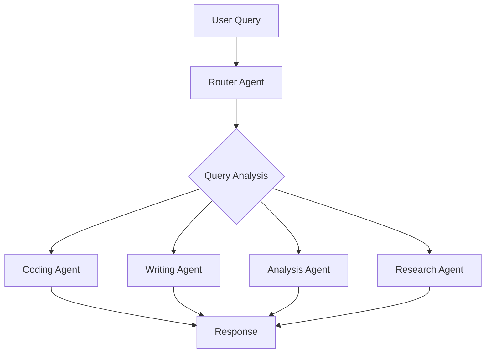

# Multi-Agent Router

[](https://www.python.org/)
[](https://www.langchain.com/)
[](https://openai.com/)
[](https://streamlit.io/)

A sophisticated multi-agent system that intelligently routes queries to specialized AI agents based on the nature of the request, providing optimized responses for different types of tasks.

## Table of Contents
- [Overview](#overview)
- [Features](#features)
- [Architecture](#architecture)
- [Installation](#installation)
- [Usage](#usage)
- [Agents](#agents)
- [Configuration](#configuration)
- [Project Structure](#project-structure)
- [API Reference](#api-reference)
- [Contributing](#contributing)
- [License](#license)

## Overview

The Multi-Agent Router is an intelligent system that analyzes incoming queries and routes them to the most appropriate specialized agent. This ensures that each query is handled by an AI agent specifically optimized for that type of task, resulting in higher quality and more relevant responses.

## Features

- **🤖 Intelligent Routing**: Automatically detects query intent and routes to appropriate agents
- **🔧 Specialized Agents**: Multiple agents optimized for different tasks (coding, writing, analysis, etc.)
- **⚡ LangChain Integration**: Built with LangChain for robust AI workflows
- **💬 Streamlit UI**: User-friendly web interface for easy interaction
- **🎯 Context Awareness**: Maintains conversation context across agent interactions
- **📊 Performance Monitoring**: Tracks agent performance and response quality
- **🔌 Extensible Architecture**: Easy to add new agents and routing rules

## Architecture



## Installation

### Prerequisites
- Python 3.8 or higher
- OpenAI API key

### Step-by-Step Setup

1. **Clone the repository**
```bash
git clone https://github.com/znblrean/multi-agent-router.git
cd multi-agent-router
```

2. **Create a virtual environment**
```bash
python -m venv venv
source venv/bin/activate  # On Windows: venv\Scripts\activate
```

3. **Install dependencies**
```bash
pip install -r requirements.txt
```

4. **Set up environment variables**
   - Create a `.env` file in the root directory
   - Add your OpenAI API key:
```env
OPENAI_API_KEY=your_openai_api_key_here
```

## Usage

### Running the Application

1. **Start the Streamlit app**
```bash
streamlit run app.py
```

2. **Access the application**
   - Open your web browser and go to `http://localhost:8501`
   - Enter your query and let the router direct it to the appropriate agent

### Command Line Usage

```bash
python main.py --query "Your question here"
```

### API Usage

```python
from multi_agent_router import Router

router = Router()
response = router.route_query("How do I implement a binary search in Python?")
print(response)
```

## Agents

### Available Specialized Agents

| Agent | Purpose | Best For |
|-------|---------|----------|
| **Coding Agent** | Programming and technical questions | Code examples, debugging, algorithms |
| **Writing Agent** | Content creation and editing | Articles, emails, creative writing |
| **Analysis Agent** | Data analysis and interpretation | Data insights, statistics, reports |
| **Research Agent** | Information gathering | Facts, explanations, knowledge queries |
| **General Agent** | Fallback for unspecified queries | General questions and conversations |

### Agent Capabilities

- **Coding Agent**: Python, JavaScript, Java, C++, algorithms, debugging
- **Writing Agent**: Blog posts, emails, creative writing, editing, proofreading
- **Analysis Agent**: Data interpretation, statistical analysis, trend spotting
- **Research Agent**: Fact-checking, explanations, knowledge retrieval

## Configuration

### Environment Variables

```env
OPENAI_API_KEY=your_api_key_here
OPENAI_MODEL=gpt-4
LANGCHAIN_TRACING=True
LANGCHAIN_ENDPOINT=your_langchain_endpoint
```

### Model Settings

```python
# Default configuration
config = {
    "model": "gpt-4",
    "temperature": 0.7,
    "max_tokens": 1000,
    "routing_threshold": 0.8
}
```

## Project Structure

```
multi-agent-router/
├── app.py                 # Streamlit web interface
├── main.py               # Command line interface
├── requirements.txt      # Python dependencies
├── .env.example         # Environment variables template
├── README.md            # Project documentation
├── agents/              # Specialized agent implementations
│   ├── __init__.py
│   ├── base_agent.py    # Base agent class
│   ├── coding_agent.py  # Programming specialist
│   ├── writing_agent.py # Content creation specialist
│   ├── analysis_agent.py # Data analysis specialist
│   └── research_agent.py # Research specialist
├── router/              # Routing logic
│   ├── __init__.py
│   └── query_router.py  # Intelligent query routing
├── utils/               # Utility functions
│   ├── __init__.py
│   └── helpers.py       # Helper functions
└── tests/               # Test suite
    ├── __init__.py
    └── test_agents.py   # Agent tests
```

## API Reference

### Router Class

```python
class Router:
    def route_query(self, query: str) -> str:
        """
        Route a query to the appropriate agent and return response
        
        Args:
            query (str): User query string
            
        Returns:
            str: Agent response
        """
```

### Base Agent Class

```python
class BaseAgent:
    def process_query(self, query: str) -> str:
        """
        Process query using agent's specialized capabilities
        """
```

## Contributing

We welcome contributions from the community! Here's how you can help:

### Reporting Issues
- Use the GitHub Issues tab
- Provide detailed description and reproduction steps
- Include system information and error logs

### Feature Requests
- Suggest new agents or routing improvements
- Propose UI/UX enhancements
- Suggest performance optimizations

### Development

1. **Fork the repository**
2. **Create a feature branch**
```bash
git checkout -b feature/new-agent
```
3. **Make your changes**
4. **Run tests**
```bash
python -m pytest tests/
```
5. **Submit a pull request**

### Adding New Agents

1. Create new agent file in `agents/` directory
2. Extend `BaseAgent` class
3. Implement `process_query` method
4. Update router logic in `router/query_router.py`
5. Add tests in `tests/test_agents.py`

## License

This project is licensed under the MIT License - see the [LICENSE](LICENSE) file for details.

## Support

- 📧 **Email**: Zenoomalik@gmail.com
- 🐛 **Issues**: [GitHub Issues](https://github.com/znblrean/multi-agent-router/issues)
- 💬 **Discussions**: [GitHub Discussions](https://github.com/znblrean/multi-agent-router/discussions)

## Acknowledgments

- [LangChain](https://www.langchain.com/) for the excellent AI orchestration framework
- [OpenAI](https://openai.com/) for powerful language models
- [Streamlit](https://streamlit.io/) for the intuitive web framework
- Contributors and users who help improve this project

---

**⭐ If you find this project useful, please consider giving it a star on GitHub!**
